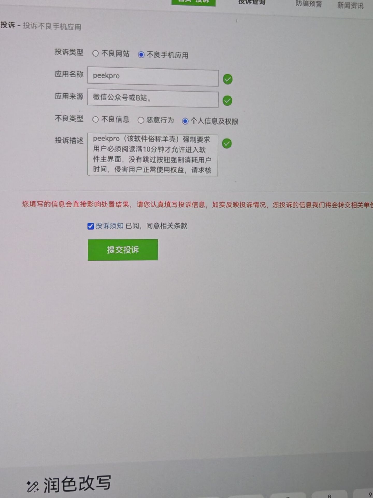

# PeekPro

> ## 项目已停止维护
>
> 本项目不再更新、不再解答问题，现已存档。

---

## 投诉截图

---

## 致各位使用 PeekPro 的朋友

我决定不再维护这个项目，就此停更跑路了。

从头到尾，软件没有一分钱收费，没有弹窗广告，耗费大量业余时间持续打磨，本是纯粹分享爱好。

可即便做到这个份上，依然遭遇恶意投诉、无端挑刺。费心设置的免责提示，被当成投诉把柄，百般挑剔。10分钟更新说明，写的很清楚每次的变动，可有些人从来不看，莫名其妙就开骂、问的问题基本都能在日志或置顶找到、我还要一遍遍回答。现在倒好，反手一个投诉，“恶意行为”“侵害权益”——我免费做的东西，逼你看了还是收你钱了？

有些人一边白嫖一边当大爷，问问题理直气壮，投诉起来义正词严。免费的东西用出付费的优越感，我是真没见过这阵仗。

真心换来消耗，热情不断被消磨。我很累，也很委屈。

惹不起，只能躲开。后续不再更新、不再解答问题，项目存档停止维护。10分钟都等不了的人，本来就不配用我的软件，现在好了，大家都别用了。

行，你们赢了，我滚。但麻烦下次投诉之前先想想——这东西没收你钱，没人欠你的。

已经看透了这个圈子，江湖路远，再也不见，别再问了。不用私信问我怎么回事了，去问投诉的人，他们比我清楚。
